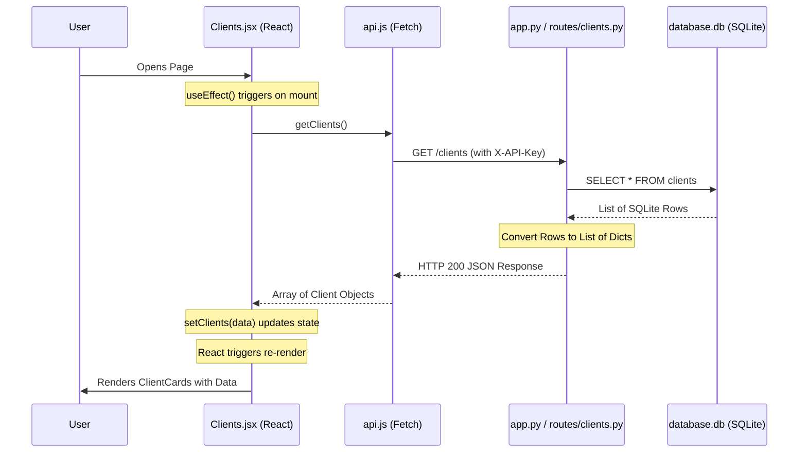

# Client Data Flow Documentation

This document explains how client data travels from the SQLite database in the backend to being rendered on the screen in the React frontend.

## Data Flow Diagram




## Step-by-Step Breakdown

### 1. The Trigger (`Clients.jsx`)

When the `Clients` page is loaded (mounted), the `useEffect` hook runs. It calls the `fetchClients` function.

```javascript
useEffect(() => {
  fetchClients();
}, []);
```

### 2. The Request (`api.js`)

`fetchClients` calls `getClients()` from `api.js`. This function uses the `fetch` API to make an asynchronous HTTP request to the Flask backend. It includes the `X-API-Key` for authentication.

```javascript
// api.js
export const getClients = () => request("/clients");

// request helper adds the URL and Headers
const response = await fetch("http://localhost:5000/clients", { headers });
const data = await response.json();
```

### 3. The Backend Processing (`routes/clients.py`)

The Flask server receives the request. The `@require_api_key` decorator validates the key. The `get_clients` function then:

1. Opens a connection to `database.db`.
2. Executes `SELECT * FROM clients`.
3. Converts the SQLite `Row` objects into standard Python `dict` objects (so they can be turned into JSON).
4. Returns a JSON array to the frontend.

```python
@clients_bp.route("/clients", methods=["GET"])
@require_api_key
def get_clients():
    conn = get_connection()
    rows = conn.execute("SELECT * FROM clients").fetchall()
    conn.close()
    clients = [dict(row) for row in rows]
    return jsonify(clients), 200
```

### 4. State Management (`Clients.jsx`)

Once the JSON data arrives back at the frontend, the `api.js` promise resolves, and the data is passed to `setClients`.

```javascript
const data = await getClients();
setClients(data); // This updates the 'clients' state
```

### 5. Rendering (`ClientCard.jsx`)

When the `clients` state changes, React automatically re-renders the component. The code maps through the array and creates a `ClientCard` for each object.

```javascript
{clients.map(client => (
  <ClientCard
    key={client.client_id}
    client={client} // The whole object is passed as a prop
  />
))}
```

Inside `ClientCard.jsx`, the data is accessed via the `client` prop:

- `client.company_name`
- `client.contact_email`
- `client.service_type`
